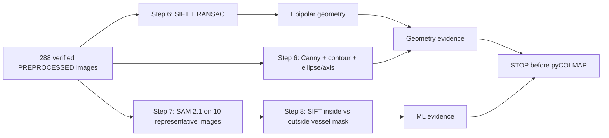

# Thai Libation Brass Vessel 3D Reconstruction

Computer vision coursework project for reconstructing a real Thai brass libation vessel from smartphone photographs.

The explainable project pipeline is:

```text
smartphone capture
-> OpenCV quality analysis and conservative preprocessing
-> pyCOLMAP feature extraction and matching
-> Structure from Motion / sparse reconstruction
-> dense reconstruction where practical
-> meshing and texturing
-> Blender cleanup and final model
```

## Project status

The real-image preprocessing and QA phase is complete and verified. The project is ready to begin pyCOLMAP, but no pyCOLMAP reconstruction has been run yet.

Measured preprocessing result:

- 297 immutable OPPO Reno12 F JPEG captures at 3072 x 4080;
- 207 `ACCEPT`, 81 `WARN`, and 9 `REJECT` decisions;
- all `ACCEPT` and `WARN` images retained, giving 288 final inputs;
- rejects are exactly images 289-297, the separate hand-held/flipped sequence with object movement and hand occlusion;
- PREPROCESSED selected from ten neighboring-pair SIFT comparisons using the exact exported quality-95 JPEG encoding: 2,483 fundamental-matrix RANSAC inliers versus 2,376 for RAW, with PREPROCESSED non-worse on 9 of 10 pairs;
- all 288 selected outputs reopened successfully at 3072 x 4080 with no duplicate hashes;
- all 297 originals re-hashed against the publication baseline with zero size or SHA-256 mismatches.

The exact next-stage input directory is:

```text
preprocessing/pycolmap_input/images/
```

Read [`preprocessing/pycolmap_input/README.md`](preprocessing/pycolmap_input/README.md) before reconstruction. The full measured method, tables, visual evidence, verification details, and limitations are in [`docs/preprocessing/preprocessing-results.md`](docs/preprocessing/preprocessing-results.md).

## Planned geometry + machine-learning extension

The next work is documented but **not implemented yet** and is intentionally split into two bounded implementation plans. The project will stop after Steps 6-8; pyCOLMAP is not part of the current implementation scope.

### Step 6 — Geometry Detection / Analysis

- SIFT keypoints and candidate matches;
- Fundamental Matrix + RANSAC inliers;
- epipolar lines and geometric residuals;
- Canny edges, contours, ellipse fitting where valid, centroid/bounding box, and principal/symmetry axis;
- real presentation-ready geometry figures.

### Steps 7 + 8 — SAM 2.1 + Feature-Mask Analysis

- pretrained Meta SAM 2.1 using `sam2.1_hiera_small` first;
- prompt-based vessel segmentation on ten representative selected images: `15, 45, 75, 105, 135, 165, 195, 225, 255, 280`;
- binary vessel-mask QA and overlays;
- reuse Step 6 SIFT extraction to measure keypoints inside versus outside each mask;
- real presentation-ready segmentation and feature-mask figures.



- Design: [`docs/superpowers/specs/2026-08-27-geometry-ml-integration-design.md`](docs/superpowers/specs/2026-08-27-geometry-ml-integration-design.md)
- Plan index: [`docs/superpowers/plans/2026-08-27-geometry-ml-integration.md`](docs/superpowers/plans/2026-08-27-geometry-ml-integration.md)
- Step 6 implementation plan: [`docs/superpowers/plans/2026-08-27-step-6-geometry-detection-analysis.md`](docs/superpowers/plans/2026-08-27-step-6-geometry-detection-analysis.md)
- Steps 7+8 implementation plan: [`docs/superpowers/plans/2026-08-27-steps-7-8-ml-segmentation-feature-mask-analysis.md`](docs/superpowers/plans/2026-08-27-steps-7-8-ml-segmentation-feature-mask-analysis.md)

## Why preprocessing is conservative

Polished brass naturally produces moving specular highlights. Reflection alone is not a rejection reason. The selected transform changes only luminance photometry: CLAHE-enhanced LAB luminance is blended at 15% with the original luminance.

The workflow does **not** crop, rotate, resize, warp, perspective-correct, synthesize detail, remove reflections with AI, or otherwise move image features. Final derived images keep the original 3072 x 4080 geometry.

## Reproduce preprocessing

```powershell
python -m venv .venv
.\.venv\Scripts\Activate.ps1
python -m pip install -r requirements.txt
python -m py_compile quality_check.py preprocess_images.py run_preprocessing.py
python -B -m pytest -p no:cacheprovider -q
python run_preprocessing.py
```

`run_preprocessing.py` verifies the raw baseline before processing, writes deterministic reports/previews/selected outputs outside the raw folder, and verifies the raw baseline again at the end. It never invokes pyCOLMAP.

The verified local environment used Python 3.14.2, OpenCV 4.13.0, NumPy 2.4.0, Pillow 12.1.1, and pytest 9.1.1.

## Repository layout

```text
quality_check.py                         quality metrics, calibration, decisions
preprocess_images.py                     geometry-preserving photometric transform
run_preprocessing.py                     reports, previews, SIFT experiment, export
tests/                                   21 focused behavior/integration tests
preprocessing/reports/                   audit and final measured reports
preprocessing/previews/contact_sheets/   full raw-sequence visual audit
preprocessing/previews/final/            before/after, decision, and SIFT figures
preprocessing/pycolmap_input/images/      exact 288-image next-stage input set
IMG20260826122949/                        versioned immutable raw photographs
docs/preprocessing/                       measured method, results, and verification evidence
```

The separate local `IMG20260826122949.zip` is only a redundant archive of the same photographs. It is intentionally untracked and is not part of the publication set.

## Evidence entry points

- `preprocessing/reports/quality_decisions.csv` — one final decision and reason set per raw image.
- `preprocessing/reports/quality_thresholds.json` — thresholds derived from eligible real-capture distributions.
- `preprocessing/reports/sift_matching.csv` and `.json` — pair-level RAW/PREPROCESSED evidence and selection rule.
- `preprocessing/reports/selection_manifest.csv` — dimensions, hashes, and decision provenance for every selected output.
- `preprocessing/reports/raw_verification_after.json` — final raw-data immutability proof.
- `preprocessing/reports/preprocessing_summary.json` — phase-level count and outcome summary.
- `preprocessing/previews/final/` — ten before/after previews, four complete WARN/REJECT sheets, and the SIFT inlier chart.

## Collaboration

Project contributors:

- Sithu Win San
- Eaint Myat Thu
- Gulizara Benjapalaporn

Read `CONTRIBUTING.md` before changing the repository and `AGENTS.md` before using an AI coding agent. Raw capture images must remain immutable.

## Course relevance

The project demonstrates image-quality measurement, feature detection and matching, geometric verification, Structure from Motion preparation, and later multi-view 3D reconstruction using a real Thai cultural object.

## License

Code and repository-authored material are released under the [MIT License](LICENSE) by Sithu Win San, Eaint Myat Thu, and Gulizara Benjapalaporn. Raw photographs and third-party assets are not automatically covered by the software license unless explicitly stated.
