# Thai Libation Brass Vessel 3D Reconstruction

Computer vision coursework project for reconstructing a real Thai brass libation vessel from smartphone photographs.

The explainable project pipeline is:

```text
smartphone capture
-> OpenCV quality analysis and conservative preprocessing
-> classical 2D/two-view geometry analysis
-> custom CNN vessel segmentation + SIFT feature-mask analysis
-> Step 9 reconstruction-readiness benchmark + connectivity/camera audit
-> pyCOLMAP feature extraction and matching
-> Structure from Motion / sparse reconstruction
-> bounded sparse-component bridge diagnosis and recovery attempt
-> dense reconstruction where practical
-> meshing and texturing
-> Blender cleanup and final model
```

## Project status

The real-image preprocessing, QA, Step 6 classical geometry analysis, Steps
7+8 custom CNN segmentation/SIFT feature-mask analysis, Step 9
reconstruction-readiness analysis, Step 10 sparse SfM, and Step 11 bounded
sparse-component bridging are complete and verified. Step 11 exhausted the
authorized recovery path but still produced disconnected sparse components, so
the project stops before dense reconstruction rather than treating a fragmented
73-image component or a 224-image multi-model union as one complete model.

Measured preprocessing result:

- 297 immutable OPPO Reno12 F JPEG captures at 3072 x 4080;
- 207 `ACCEPT`, 81 `WARN`, and 9 `REJECT` decisions;
- all `ACCEPT` and `WARN` images retained, giving 288 final inputs;
- rejects are exactly images 289-297, the separate hand-held/flipped sequence with object movement and hand occlusion;
- PREPROCESSED selected from ten neighboring-pair SIFT comparisons using the exact exported quality-95 JPEG encoding: 2,483 fundamental-matrix RANSAC inliers versus 2,376 for RAW, with PREPROCESSED non-worse on 9 of 10 pairs;
- all 288 selected outputs reopened successfully at 3072 x 4080 with no duplicate hashes;
- all 297 originals re-hashed against the publication baseline with zero size or SHA-256 mismatches.

Measured Step 6 geometry result:

- all 288 selected inputs were re-verified against the selection manifest before analysis;
- neighboring pair 165-166 produced 478 ratio-test candidates and 300 Fundamental Matrix RANSAC inliers, an inlier ratio of 0.628;
- supporting pair 255-256 produced 57 candidates and 18 inliers, honestly retaining its lower-feature result;
- primary-pair median Sampson error was 0.1431 analysis pixels squared;
- classical contour/PCA measurements were produced for images 165 and 255; the weak global ellipse for the non-elliptical side view was deliberately omitted, while the top-down/detail ellipse passed residual checks;
- six real presentation figures and five machine-readable reports were generated under `analysis/`;
- all 297 raw photographs and all 288 selected images were rechecked unchanged after analysis.

Measured Steps 7+8 ML result:

- 36 reviewed source-size vessel masks were frozen as 24 train / 6 validation / 6 held-out test using a sequence-aware split;
- `SmallSegCNN` was trained from random initialization with **487,297** trainable parameters, no pretrained weights, and fixed 384 x 288 model input geometry;
- training stopped after 49 epochs; best epoch 39 reached validation Dice **0.9681** and IoU **0.9383**;
- frozen held-out test performance over all six images was mean Dice **0.9525** and mean IoU **0.9107**;
- held-out index 72 is retained as the visible weak case because the CNN includes a large yellow-wall background false positive;
- Step 8 reused `geometry_detection.extract_sift` on CNN-predicted masks: 28,673 total SIFT keypoints, 27,431 classified inside the predicted vessel and 1,242 outside;
- all six ML presentation figures were generated from real outputs and visually inspected;
- final integrity checks again found 0 raw mismatches across 297 photographs and verified all 288 selected images.

Measured Step 9 reconstruction-readiness result:

- the frozen CNN produced 288 source-size full-sequence predictions plus 288 deterministic cleanup masks; cleanup changed 30 predictions while retaining known connected false positives such as index 72 instead of manually repairing them;
- a frozen 20-pair x 3-mode SIFT/Fundamental-Matrix benchmark chose **unmasked** features: 3,146 RANSAC inliers versus 2,841 for both masked modes; each masked mode retained only 90.31% of unmasked inliers and failed the predeclared 95% qualification floor;
- the full 287-edge adjacent-sequence audit found 273 strong and 14 weak transitions; 14 local skip bridges were tested and none was strong, so the conservative recommended reconstruction subset remains **288/288 images**;
- EXIF audit of all 288 selected filenames found one complete camera signature: OPPO Reno12 F, 3072 x 4080, orientation 1, 3.98 mm focal length, 26 mm 35-mm equivalent, digital zoom 1.0; one shared camera/intrinsics group is therefore the measured starting recommendation;
- final Step 9 verification passed 26 focused tests and 92 complete project tests; all 297 raw photographs and all 288 selected images remained unchanged.

Measured Step 10 sparse-SfM result:

- pyCOLMAP 4.2.0 used native unmasked SIFT with one shared `SIMPLE_RADIAL` camera and CPU-only feature extraction; the final internal sparse-SIFT limit was 1200 pixels while the 3072 x 4080 source JPEGs remained unchanged;
- the overlap-20 baseline extracted 1,255,153 SIFT features and returned 7 sparse components; the largest registered **73/288 images** with **6,099 points**, mean track length **3.5007**, and mean reprojection error **1.2373 px**;
- the single planned overlap-40 retry also returned 7 components and did not improve the largest-component registration count; its largest model registered 73 images with 5,769 points;
- the frozen ranking rule therefore selected the baseline 73-image component and exported it to `reconstruction/sparse/best/` plus `points3D.ply`;
- the baseline components cover 216 distinct images in total and the retry components cover 223, confirming that the dataset reconstructs locally but does not yet form one global coordinate frame;
- the selected component has a coherent camera arc and plausible sparse geometry, but the fixed >=274-image single-model acceptance target was not met, so dense reconstruction has **not** started.

Measured Step 11 sparse-component-bridging result:

- the deterministic non-local diagnosis evaluated exactly 2,340 candidates: 780 around each fixed boundary 73-74, 145-146, and 203-204;
- boundaries 73-74 and 145-146 produced zero geometrically verified inliers across all candidates, while 203-204 produced 68 qualified candidates and 8 deterministically selected bridges;
- targeted mapping was correctly skipped because every boundary needed at least one selected qualified bridge;
- the one allowed CPU exhaustive fallback, using block size 50 and the shared Step 10 feature/mapping configuration, produced 8 sparse models and 224-image union coverage;
- its strongest single model registered **73/288 images** with **3,443 points**, mean track length **3.7508**, and mean reprojection error **1.1989 px** using one `SIMPLE_RADIAL` camera;
- the selected model's local camera arc and point structure are plausible, but registration remains limited to indices 1-73, so `bridge_success=false` and dense reconstruction remains blocked.

The verified reconstruction input directory remains:

```text
preprocessing/pycolmap_input/images/
```

Read [`preprocessing/pycolmap_input/README.md`](preprocessing/pycolmap_input/README.md), [`docs/geometry-ml/reconstruction-readiness.md`](docs/geometry-ml/reconstruction-readiness.md), [`docs/geometry-ml/sparse-reconstruction.md`](docs/geometry-ml/sparse-reconstruction.md), and [`docs/geometry-ml/sparse-component-bridging.md`](docs/geometry-ml/sparse-component-bridging.md). The measured preprocessing method remains documented in [`docs/preprocessing/preprocessing-results.md`](docs/preprocessing/preprocessing-results.md).

## Geometry + machine-learning extension

Steps 6-11 are implemented and verified. Step 11 executed the fixed non-local
diagnosis, conditional targeted gate, and one exhaustive fallback, but the
288-image sequence remains fragmented into multiple sparse models. The current
boundary therefore stops before dense reconstruction.

### Step 6 — Geometry Detection / Analysis

- implemented SIFT keypoints and candidate matches;
- implemented Fundamental Matrix + exact RANSAC inlier handling;
- implemented epipolar lines and Sampson residuals;
- implemented Canny edges, classical contours, ellipse fitting where valid,
  centroid/bounding box, and PCA principal axis;
- generated and visually verified six presentation-ready geometry figures.

### Steps 7 + 8 — From-Scratch CNN + Feature-Mask Analysis

- froze 36 reviewed binary vessel masks as 24 train / 6 validation / 6 held-out test using separated capture positions/view groups rather than a random neighboring-frame split;
- trained a small U-Net-like `SmallSegCNN` from random initialization with no pretrained weights;
- selected epoch 39 from validation only, then evaluated the locked 0.5-threshold model on all six held-out images;
- measured held-out mean Dice 0.9525 and mean IoU 0.9107 while retaining the image-72 background false positive;
- reused Step 6 SIFT extraction to measure keypoints inside versus outside CNN-predicted vessel masks;
- generated and visually reviewed six training, segmentation, feature-mask, and summary figures from real outputs.

### Step 9 — Reconstruction Readiness

- ran the frozen `SmallSegCNN` on all 288 selected inputs without retraining or test-driven threshold changes;
- generated separate raw CNN predictions and conservative connected-component cleanup masks;
- benchmarked unmasked, raw-CNN-mask, and cleanup-mask SIFT across 20 frozen representative pairs using the existing Step 6 geometry stack;
- selected **unmasked** SIFT because both masked variants lost too many RANSAC inliers despite slightly lower Sampson error;
- audited all 287 adjacent image transitions and retained all 288 selected frames because no weak middle frame had a strong predecessor/successor skip bridge;
- audited raw EXIF for every selected filename and measured one consistent camera signature supporting a shared-intrinsics starting configuration;
- generated and visually reviewed four Step 9 figures and machine-readable reports while explicitly stopping before pyCOLMAP.

### Step 10 — Sparse Structure from Motion

- added a bounded pyCOLMAP 4.2 sparse-SfM pipeline using native unmasked SIFT, one shared `SIMPLE_RADIAL` camera, sequential matching, and incremental mapping;
- used an internal 1200-pixel sparse-SIFT limit after the Windows pyCOLMAP wheel proved CPU-only; source JPEGs remain at 3072 x 4080;
- baseline overlap 20 produced seven sparse models; its largest component registered 73 images with 6,099 points and 1.2373 px mean reprojection error;
- the single planned overlap-40 retry also produced seven models and did not increase the largest component beyond 73 images;
- selected the baseline component by the frozen ranking rule and exported binary COLMAP files plus `points3D.ply` under `reconstruction/sparse/best/`;
- visually verified a coherent local camera trajectory and point cloud, but recorded `acceptance_met=false` because the full sequence remains fragmented;
- stopped before dense reconstruction instead of hiding fragmentation or adding unplanned parameter sweeps.

### Step 11 — Sparse Component Bridging

- generated exactly 2,340 non-local candidate pairs around the three fixed component boundaries and matched them in one diagnostic database;
- found no geometrically verified bridge at 73-74 or 145-146, so the targeted-attempt gate failed closed without running a mapper;
- ran exactly one CPU exhaustive fallback with block size 50, producing eight sparse models with 224-image union coverage;
- selected the strongest single exhaustive component, which registers 73 images with 3,443 points and 1.1989 px mean reprojection error;
- visually verified that its camera arc and point cloud are plausible only as a local component and that the registration plot reports indices 1-73 rather than the disconnected union;
- recorded `bridge_success=false` and preserved the stop before dense reconstruction.

```mermaid
flowchart LR
    A[288 verified PREPROCESSED images] --> B[Step 6: SIFT + RANSAC]
    B --> C[Epipolar geometry]
    A --> D[Step 6: Canny + contour + ellipse/axis]
    A --> E[Manual vessel masks + leakage-safe split]
    E --> F[Step 7: SmallSegCNN trained from scratch]
    F --> G[Held-out predictions + Dice/IoU]
    G --> H[Step 8: SIFT inside vs outside predicted mask]
    C --> I[Verified Step 6 geometry evidence]
    D --> I
    H --> J[ML evidence]
    I --> K[Step 9: masked vs unmasked benchmark]
    J --> K
    K --> L[287-edge connectivity + EXIF audit]
    L --> M[Step 10: pyCOLMAP sparse SfM]
    M --> N[Step 11: bounded bridge diagnosis]
    N --> O[Targeted gate skipped]
    O --> P[One exhaustive fallback]
    P --> Q[8 disconnected sparse components]
    Q --> R[STOP before dense reconstruction]
```



- Design: [`docs/superpowers/specs/2026-08-27-geometry-ml-integration-design.md`](docs/superpowers/specs/2026-08-27-geometry-ml-integration-design.md)
- Plan index: [`docs/superpowers/plans/2026-08-27-geometry-ml-integration.md`](docs/superpowers/plans/2026-08-27-geometry-ml-integration.md)
- Step 6 measured results: [`docs/geometry-ml/geometry-results.md`](docs/geometry-ml/geometry-results.md)
- CNN dataset and split: [`docs/geometry-ml/cnn-dataset.md`](docs/geometry-ml/cnn-dataset.md)
- Steps 7+8 measured results: [`docs/geometry-ml/ml-results.md`](docs/geometry-ml/ml-results.md)
- Step 9 measured readiness: [`docs/geometry-ml/reconstruction-readiness.md`](docs/geometry-ml/reconstruction-readiness.md)
- Step 10 measured sparse reconstruction: [`docs/geometry-ml/sparse-reconstruction.md`](docs/geometry-ml/sparse-reconstruction.md)
- Step 11 measured sparse bridging: [`docs/geometry-ml/sparse-component-bridging.md`](docs/geometry-ml/sparse-component-bridging.md)
- Step 6 implementation plan: [`docs/superpowers/plans/2026-08-27-step-6-geometry-detection-analysis.md`](docs/superpowers/plans/2026-08-27-step-6-geometry-detection-analysis.md)
- Steps 7+8 implementation plan: [`docs/superpowers/plans/2026-08-27-steps-7-8-ml-segmentation-feature-mask-analysis.md`](docs/superpowers/plans/2026-08-27-steps-7-8-ml-segmentation-feature-mask-analysis.md)
- Step 9 implementation-plan index: [`docs/superpowers/plans/2026-09-05-step-9-reconstruction-readiness.md`](docs/superpowers/plans/2026-09-05-step-9-reconstruction-readiness.md)
- Step 10 design: [`docs/superpowers/specs/2026-09-05-step-10-sparse-sfm-design.md`](docs/superpowers/specs/2026-09-05-step-10-sparse-sfm-design.md)
- Step 10 implementation plan: [`docs/superpowers/plans/2026-09-05-step-10-sparse-sfm.md`](docs/superpowers/plans/2026-09-05-step-10-sparse-sfm.md)
- Step 11 design: [`docs/superpowers/specs/2026-09-05-step-11-sparse-component-bridging-design.md`](docs/superpowers/specs/2026-09-05-step-11-sparse-component-bridging-design.md)
- Step 11 implementation plan: [`docs/superpowers/plans/2026-09-05-step-11-sparse-component-bridging.md`](docs/superpowers/plans/2026-09-05-step-11-sparse-component-bridging.md)

## Why preprocessing is conservative

Polished brass naturally produces moving specular highlights. Reflection alone is not a rejection reason. The selected transform changes only luminance photometry: CLAHE-enhanced LAB luminance is blended at 15% with the original luminance.

The workflow does **not** crop, rotate, resize, warp, perspective-correct, synthesize detail, remove reflections with AI, or otherwise move image features. Final derived images keep the original 3072 x 4080 geometry.

## Reproduce preprocessing

```powershell
python -m venv .venv
.\.venv\Scripts\Activate.ps1
python -m pip install -r requirements.txt
python -m py_compile quality_check.py preprocess_images.py run_preprocessing.py
python -B -m pytest -p no:cacheprovider -q
python run_preprocessing.py
```

`run_preprocessing.py` verifies the raw baseline before processing, writes deterministic reports/previews/selected outputs outside the raw folder, and verifies the raw baseline again at the end. It never invokes pyCOLMAP.

The verified local environment used Python 3.14.2, OpenCV 4.13.0, NumPy 2.4.0, Pillow 12.1.1, and pytest 9.1.1.

## Reproduce Step 6 geometry analysis

Run the deterministic analysis and regenerate its reports and presentation
figures:

```powershell
python -B run_geometry_analysis.py
```

Open the live OpenCV popup views; press `q` or `Esc` to close all windows:

```powershell
python -B show_geometry_visuals.py --mode all
```

Modes `matches`, `epipolar`, and `shape` are also available. For a bounded
non-GUI smoke check, add `--no-display`.

## Reproduce Steps 7+8 ML analysis

The frozen label split and model code are in the repository. The final model
checkpoint is kept locally by default rather than published as repository
content.

Train the fixed baseline from random initialization:

```powershell
python -B train_cnn_segmentation.py
```

After training/validation decisions are frozen, evaluate the held-out test set
and regenerate the Step 8 reports/figures:

```powershell
python -B run_ml_analysis.py
```

The measured run used Python 3.14.2, PyTorch 2.13.0+cu130, torchvision
0.28.0+cu130, CUDA 13.0, and an NVIDIA GeForce RTX 5050 Laptop GPU.

## Reproduce Step 9 reconstruction-readiness analysis

The Step 9 orchestrator is stage-bounded and never invokes pyCOLMAP:

```powershell
python -B run_reconstruction_readiness.py --stage masks
python -B run_reconstruction_readiness.py --stage benchmark
python -B run_reconstruction_readiness.py --stage connectivity
python -B run_reconstruction_readiness.py --stage camera
python -B run_reconstruction_readiness.py --stage summary
```

`--stage all` runs those same five readiness stages in order. It requires the local frozen `best_small_seg_cnn.pt` checkpoint generated by Steps 7+8. The measured Step 9 result chooses unmasked SIFT for later reconstruction preparation; the generated CNN masks remain evidence rather than mandatory reconstruction inputs.

## Reproduce Step 10 sparse SfM

Install the project requirements, then run the bounded Step 10 stages:

```powershell
python -B run_sparse_reconstruction.py --stage baseline
python -B run_sparse_reconstruction.py --stage retry
python -B run_sparse_reconstruction.py --stage finalize
```

`--stage all` performs the same sequence and skips the retry when the baseline passes the frozen acceptance gate. The measured 2026-09-05 run required the overlap-40 retry, but neither attempt produced a dominant global model. `finalize` therefore selects the best measured local component and explicitly records `acceptance_met=false`; it does not invoke any dense-reconstruction API.

## Reproduce Step 11 sparse-component bridging

The measured workflow was run as durable stages so its gate decisions and the
single exhaustive fallback remain auditable:

```powershell
python -B run_sparse_bridging.py --stage diagnose
python -B run_sparse_bridging.py --stage targeted
python -B run_sparse_bridging.py --stage exhaustive
python -B run_sparse_bridging.py --stage finalize
```

`--stage all` follows the same ordering. `targeted` runs only when every fixed
boundary has a selected qualified bridge. `exhaustive` is the one fallback and
uses CPU matching with block size 50. The measured run skipped targeted mapping,
completed the exhaustive fallback once, selected a 73-image local component,
and recorded `bridge_success=false`. No stage invokes dense reconstruction.

## Repository layout

```text
quality_check.py                         quality metrics, calibration, decisions
preprocess_images.py                     geometry-preserving photometric transform
run_preprocessing.py                     reports, previews, SIFT experiment, export
tests/                                   141 project tests after Step 11 review
analysis_common.py                       selected-manifest loading and integrity verification
geometry_detection.py                    scaled SIFT, RANSAC, epilines, and residuals
shape_geometry.py                        classical edges, contour, PCA, and optional ellipse
run_geometry_analysis.py                 Step 6 orchestration, reports, and figures
show_geometry_visuals.py                 real popup visualizer for the Step 6 flow
segmentation_data.py                     frozen label validation and paired transforms
cnn_segmentation.py                      SmallSegCNN, loss, metrics, prediction helpers
train_cnn_segmentation.py                deterministic train/validation/checkpoint workflow
ml_feature_analysis.py                   Step 6 SIFT inside/outside predicted-mask analysis
run_ml_analysis.py                       held-out evaluation, reports, and ML figures
reconstruction_masks.py                 Step 9 full-sequence inference and mask validation
reconstruction_matching.py              Step 9 matching benchmark and connectivity logic
camera_readiness.py                      Step 9 raw-EXIF camera signature audit
run_reconstruction_readiness.py          bounded Step 9 orchestration and figures/reports
sparse_reconstruction.py                 Step 10 pyCOLMAP configuration, runtime, and metrics
run_sparse_reconstruction.py             Step 10 sparse-SfM stages, reports, and figures
sparse_bridging.py                       Step 11 candidate diagnosis, gates, and sparse attempts
run_sparse_bridging.py                   Step 11 durable stages, reports, and figures
ml_dataset/                              frozen 36-label manifest and source-size masks
analysis/                                Step 6 + ML + Step 9 reports, masks, and figures
reconstruction/                          Step 10 sparse and Step 11 bridging evidence
preprocessing/reports/                   audit and final measured reports
preprocessing/previews/contact_sheets/   full raw-sequence visual audit
preprocessing/previews/final/            before/after, decision, and SIFT figures
preprocessing/pycolmap_input/images/      exact 288-image next-stage input set
preprocessing/reconstruction_input_v1/    Step 9 inclusion manifest; references, not copies
IMG20260826122949/                        versioned immutable raw photographs
docs/preprocessing/                       measured method, results, and verification evidence
```

The separate local `IMG20260826122949.zip` is only a redundant archive of the same photographs. It is intentionally untracked and is not part of the publication set.

## Evidence entry points

- `preprocessing/reports/quality_decisions.csv` — one final decision and reason set per raw image.
- `preprocessing/reports/quality_thresholds.json` — thresholds derived from eligible real-capture distributions.
- `preprocessing/reports/sift_matching.csv` and `.json` — pair-level RAW/PREPROCESSED evidence and selection rule.
- `preprocessing/reports/selection_manifest.csv` — dimensions, hashes, and decision provenance for every selected output.
- `preprocessing/reports/raw_verification_after.json` — final raw-data immutability proof.
- `preprocessing/reports/preprocessing_summary.json` — phase-level count and outcome summary.
- `preprocessing/previews/final/` — ten before/after previews, four complete WARN/REJECT sheets, and the SIFT inlier chart.
- `analysis/reports/geometry_summary.json` — Step 6 source, configuration,
  measurements, exclusions, and artifact manifest.
- `analysis/geometry/` — pair, epipolar, and classical shape measurements.
- `analysis/previews/presentation/` — the visually inspected Step 6, ML, and Step 9 presentation figures.
- `analysis/reports/cnn_training_history.csv` — real train/validation history.
- `analysis/reports/cnn_test_metrics.csv` — all six held-out segmentation results.
- `analysis/reports/cnn_summary.json` — model/runtime/split provenance and aggregate ML results.
- `analysis/reports/masked_feature_counts.csv` — Step 8 SIFT counts from CNN-predicted masks.
- `analysis/ml/predictions/` — six unedited source-size held-out CNN predictions.
- `analysis/ml/full_predictions/` — 288 frozen full-sequence CNN predictions from Step 9A.
- `analysis/ml/reconstruction_masks/` — 288 conservative deterministic Step 9 cleanup masks.
- `analysis/reports/step9_match_benchmark.json` — masked-vs-unmasked geometric decision and aggregate metrics.
- `analysis/reports/step9_connectivity.json` — full 287-edge connectivity result and weak-transition list.
- `analysis/reports/step9_camera_readiness.json` — 288-frame camera-signature audit and grouping recommendation.
- `analysis/reports/step9_summary.json` — compact final Step 9 provenance and boundary summary.
- `preprocessing/reconstruction_input_v1/manifest.csv` — all 288 include/exclude decisions; currently 288/288 included.
- `reconstruction/reports/step10_summary.json` — selected sparse component, acceptance result, camera parameters, and attempt provenance.
- `reconstruction/reports/step10_baseline.json` and `step10_retry_overlap40.json` — all sparse-component metrics for the two frozen attempts.
- `reconstruction/reports/step10_registered_images.csv` — selected-component registration status for all 288 sequence positions.
- `reconstruction/sparse/best/` — selected COLMAP sparse binary model and `points3D.ply` export.
- `reconstruction/previews/` — the two visually inspected Step 10 sparse-model and registration figures.
- `reconstruction/bridging/reports/step11_summary.json` — Step 11 gate decisions, selected model, acceptance result, and preserved Step 10 baseline.
- `reconstruction/bridging/reports/step11_candidates.csv` and `step11_boundary_summary.json` — all 2,340 non-local candidates and per-boundary qualification evidence.
- `reconstruction/bridging/reports/step11_targeted.json`, `step11_exhaustive.json`, and `step11_attempts.csv` — skipped targeted gate and the single completed exhaustive fallback.
- `reconstruction/bridging/best/` — selected Step 11 COLMAP sparse binary model and `points3D.ply` export.
- `reconstruction/bridging/previews/` — the three visually inspected Step 11 candidate, sparse-model, and registration figures.

## Collaboration

Project contributors:

- Sithu Win San
- Eaint Myat Thu
- Gulizara Benjapalaporn

Read `CONTRIBUTING.md` before changing the repository and `AGENTS.md` before using an AI coding agent. Raw capture images must remain immutable.

## Course relevance

The project demonstrates image-quality measurement, feature detection and matching, geometric verification, from-scratch CNN semantic segmentation, SIFT feature-mask analysis, Structure from Motion preparation, and later multi-view 3D reconstruction using a real Thai cultural object.

## License

Code and repository-authored material are released under the [MIT License](LICENSE) by Sithu Win San, Eaint Myat Thu, and Gulizara Benjapalaporn. Raw photographs and third-party assets are not automatically covered by the software license unless explicitly stated.
