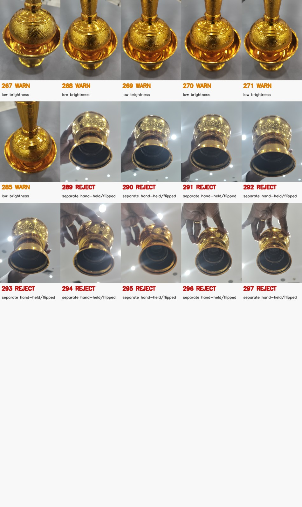
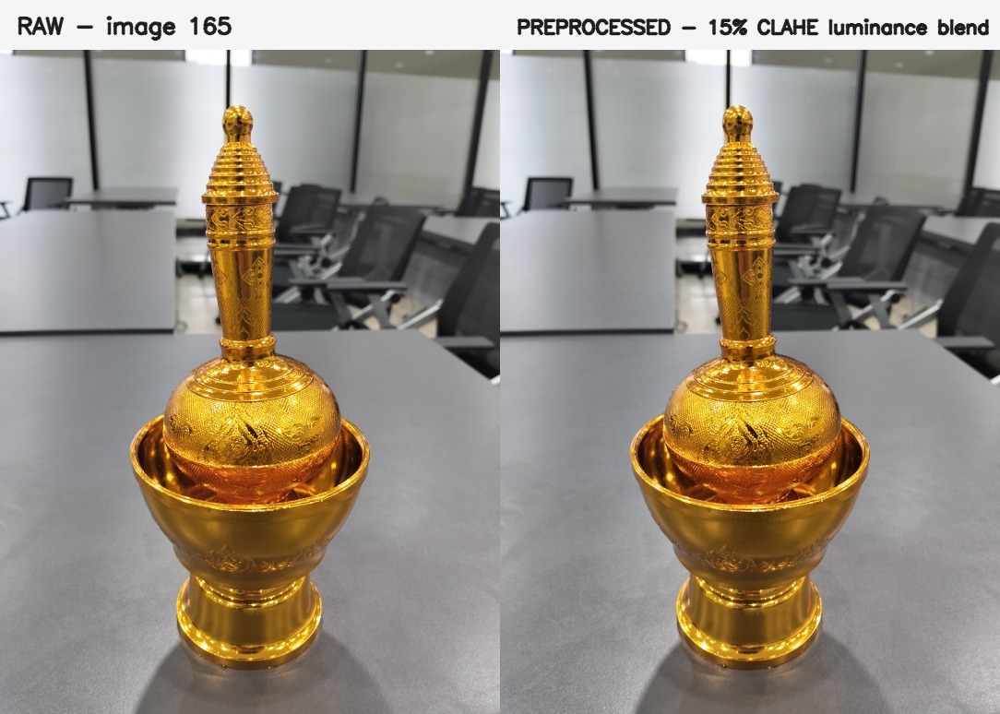
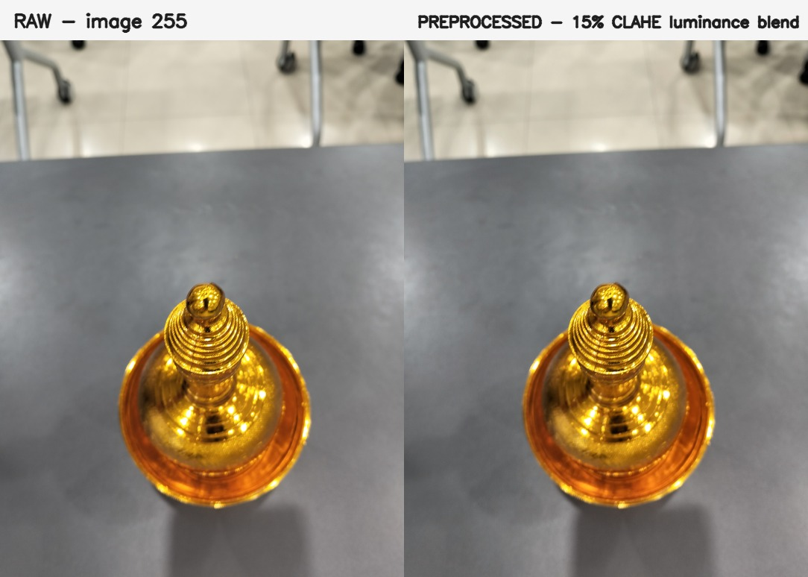
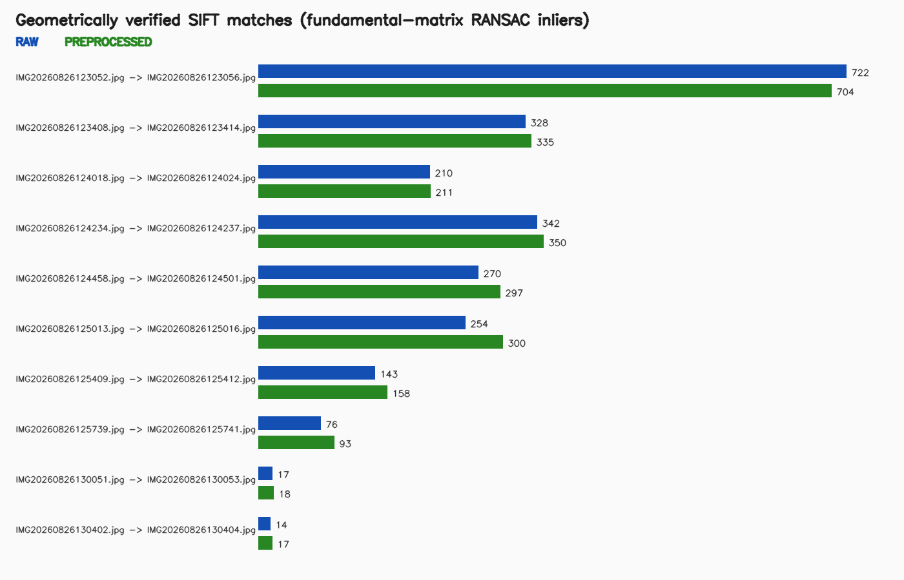

# Preprocessing Results

Updated: 2026-08-27

## Verified phase result

The real-image QA and preprocessing phase is complete. The final pyCOLMAP input is the 288-image set in `preprocessing/pycolmap_input/images/`. PREPROCESSED was selected from geometric matching evidence. All original files remain unchanged. No pyCOLMAP reconstruction has started.

| Result | Verified value |
|---|---:|
| Raw photographs | 297 |
| `ACCEPT` | 207 |
| `WARN` | 81 |
| `REJECT` | 9 |
| Selected `ACCEPT` + `WARN` images | 288 |
| Selected output geometry | 3072 x 4080 |
| RAW verified SIFT/RANSAC inliers | 2,376 |
| PREPROCESSED verified SIFT/RANSAC inliers | 2,483 |
| Pairs where PREPROCESSED was non-worse | 9 of 10 |
| Raw size/SHA-256 mismatches after processing | 0 of 297 |
| Duplicate selected-output hashes | 0 |

## Method and measured evidence

### 1. Project objective

The project reconstructs a real Thai brass libation vessel from smartphone photographs. This phase prepares trustworthy images for Structure from Motion while keeping the process explainable for computer vision coursework.

### 2. Capture methodology

The dataset contains 297 portrait JPEG photographs from an OPPO Reno12 F at 3072 x 4080. The main sequence circles the fixed vessel at middle, low, elevated, top-down, and detail viewpoints, providing dense neighboring overlap. Images 289-297 are a later hand-held/flipped sequence in which the vessel moves relative to the scene and hands enter the frame.

### 3. Why the originals are preserved

`IMG20260826122949/` is immutable source evidence. The scripts only read this folder. Reports, previews, and selected derived images are written under `preprocessing/`. The published baseline records every original filename, byte count, and SHA-256 digest.

### 4. The 297-image audit

The earlier full audit verified 297 readable JPEGs, uniform 3072 x 4080 dimensions, camera/orientation consistency, no exact SHA-256 duplicates, no conservative adjacent dHash near-duplicate candidates, and complete contact-sheet coverage. The final pipeline reused that evidence and did not rerun obsolete exploratory scripts.

### 5. Image-quality metrics

`quality_check.py` analyzes a standardized 800-pixel-wide copy in memory and records luminance mean, contrast, Laplacian-variance sharpness, dark/bright clipping, and SIFT feature count. Warning thresholds are derived from the eligible real dataset rather than copied from a demonstration.

| Threshold | Final value |
|---|---:|
| Sharpness warning | 178.1662 |
| Severe sharpness component | 131.3283 |
| Brightness low/high warning | 120.7684 / 139.3575 |
| Contrast warning | 31.1619 |
| Dark/bright clipping warning (%) | 0.1017 / 0.8486 |
| Feature-count warning | 1,320 |
| Severe feature-count component | 528 |

The severe metric components only reject when severe blur and too few local features occur together. A warning by itself remains `WARN`, not `REJECT`.

### 6. Visual/contact-sheet inspection

The ten original contact sheets cover all 297 images. After the final run, four additional decision sheets containing every one of the 81 warnings and 9 rejects were opened and inspected. The warning frames remain useful views; expected brass highlights were not treated as defects.

### 7. ACCEPT/WARN/REJECT reasoning

- `ACCEPT`: no dataset-relative review signal.
- `WARN`: one or more metric outliers, retained to protect viewpoint coverage and overlap.
- `REJECT`: unreadable/severely unusable evidence or a known capture-geometry break.

The final 9 rejects are exactly indices 289-297. Visual review confirms the vessel is hand-held/flipped, its pose/background relationship differs from the fixed-object orbit, and hands occlude it. Images 1-288 are all retained as `ACCEPT` or `WARN`.

### 8. Conservative preprocessing

`preprocess_images.py` converts BGR to LAB, applies CLAHE to luminance, blends only 15% of the enhanced luminance into the original, and converts back to BGR. It does not crop, rotate, resize, warp, perspective-correct, synthesize detail, or remove reflections. The output remains deterministic `uint8` BGR at 3072 x 4080.

### 9. RAW vs PREPROCESSED SIFT experiment

Ten neighboring pairs were chosen across the capture sequence. Both variants use OpenCV SIFT (up to 8,000 features at maximum width 1,200), brute-force L2 two-neighbor matching, Lowe ratio 0.75, and fundamental-matrix RANSAC with a 1.5-pixel threshold and 0.99 confidence. The PREPROCESSED comparison decodes deterministic quality-95 JPEG bytes produced by the same encoder as the final selected files.

| Pair indices | RAW good / inliers | PREPROCESSED good / inliers |
|---|---:|---:|
| 15-16 | 905 / 722 | 958 / 704 |
| 45-46 | 478 / 328 | 505 / 335 |
| 75-76 | 365 / 210 | 362 / 211 |
| 105-106 | 466 / 342 | 497 / 350 |
| 135-136 | 468 / 270 | 483 / 297 |
| 165-166 | 451 / 254 | 478 / 300 |
| 195-196 | 272 / 143 | 290 / 158 |
| 225-226 | 228 / 76 | 238 / 93 |
| 255-256 | 49 / 17 | 57 / 18 |
| 280-281 | 61 / 14 | 67 / 17 |
| **Total verified inliers** | **2,376** | **2,483** |

### 10. Why PREPROCESSED was selected

The rule was set before reading the outcome: choose PREPROCESSED only if total verified inliers are greater and it is non-worse on at least half of the pairs; otherwise keep RAW. PREPROCESSED produced 107 more verified inliers (4.50% more) and was non-worse on 9 of 10 pairs. Visual comparison also confirmed that the transform is mild and geometry-preserving.

### 11. Final pyCOLMAP-ready dataset

The deterministic next-stage directory is `preprocessing/pycolmap_input/images/`. It contains 288 JPEGs using their original capture filenames. Every file was reopened successfully, every size is 3072 x 4080, every hash matches `selection_manifest.csv`, and no duplicate hashes were found.

### 12. Hash-based proof that originals are unchanged

The pipeline verifies `raw_manifest_before.json` before processing and again afterward. A separate final audit re-hashed all 297 originals. Both checks found zero size or SHA-256 mismatches. The final machine-readable proof is `preprocessing/reports/raw_verification_after.json`.

### 13. What comes next

The current next work is split into two implementation plans and stops before reconstruction. Step 6 will make geometry explicit through SIFT/RANSAC match visualization, epipolar geometry, and classical 2D vessel-shape geometry. Combined Steps 7+8 will use pretrained SAM 2.1 on ten representative selected images and measure SIFT features inside versus outside the vessel masks.

The shared design is `docs/superpowers/specs/2026-08-27-geometry-ml-integration-design.md`. The Step 6 and Steps 7+8 implementation plans are linked from `docs/superpowers/plans/2026-08-27-geometry-ml-integration.md`. No geometry/ML implementation or pyCOLMAP reconstruction has run yet, and no reconstruction work is part of the current plan.

## Verification and limitations

Fresh verification included Python compilation, 21 focused tests, a full 297-image pipeline run, all-output reopen/dimension/hash checks, all-raw re-hashing, and visual inspection of all final decision sheets and before/after previews.

The ten-pair SIFT experiment is representative evidence, not an all-pairs benchmark and not proof that every image will register in Structure from Motion. Final reconstruction quality remains unverified until the later pyCOLMAP phase. The full `WARN` set is deliberately retained so that the reconstruction stage—not a single threshold—can reveal whether any additional frame needs removal.
