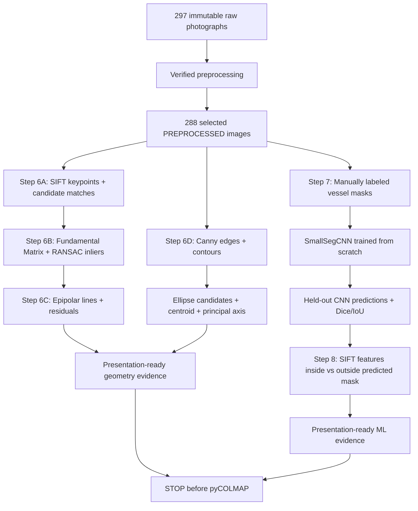

# Geometry Detection and ML Integration Design

Updated: 2026-09-05

## Status

**Preprocessing and Steps 6-8 are implemented, measured, visually reviewed, and verified. The repository stops before pyCOLMAP/reconstruction.**

The verified preprocessing milestone remains unchanged: 297 immutable raw photographs, 207 `ACCEPT`, 81 `WARN`, 9 `REJECT`, and 288 PREPROCESSED images in `preprocessing/pycolmap_input/images/`.

Step 6 produced the classical-geometry code, reports, popup visualizer, and six presentation figures described below. Steps 7+8 subsequently implemented the from-scratch `SmallSegCNN`, a frozen sequence-aware 24/6/6 segmentation split, six held-out predictions, Step 6 SIFT feature-mask analysis, and six ML presentation figures. Measured ML results are recorded in `docs/geometry-ml/cnn-dataset.md` and `docs/geometry-ml/ml-results.md`. No pyCOLMAP or reconstruction work has been run.

## Implemented extension

The completed preprocessing pipeline now includes two bounded, coursework-explainable implementation units:

### Step 6 — Geometry Detection / Analysis

1. visible SIFT keypoints and candidate feature matches;
2. Fundamental Matrix estimation and RANSAC inlier filtering;
3. epipolar-line visualization and geometric residuals from the same two-view geometry;
4. 2D vessel-shape geometry using Canny edges, contours, ellipse fitting where valid, and a principal/symmetry axis.

### Steps 7 + 8 — Custom CNN Segmentation + Feature-Mask Analysis

1. manually annotate a small leakage-controlled vessel-segmentation dataset from the verified selected images;
2. train a compact binary segmentation CNN from random initialization with no pretrained weights;
3. evaluate unedited CNN predictions on a held-out test split using Dice, IoU, precision, and recall;
4. reuse Step 6 SIFT extraction to count features inside versus outside each CNN-predicted vessel mask;
5. create presentation figures showing training behavior, held-out segmentation quality, visible failure cases, and vessel/background feature distribution.

The extension may analyze images and create derived masks/visualizations, but it must not crop, permanently resize, rotate, warp, perspective-correct, regenerate, or overwrite the 288 selected images.

## Why this design fits the project

The project already uses SIFT, Fundamental Matrix estimation, and RANSAC internally to compare RAW and PREPROCESSED image pairs. Step 6 exposes and explains this geometry rather than adding unrelated algorithms.

The single-image shape module adds intuitive classical computer vision: silhouette edges, contour candidates, ellipse-like vessel/rim structure, centroid, bounding box, and principal-axis direction. These measurements are descriptive only; they do not rectify or reshape the photographs.

The ML component is foreground segmentation rather than generative enhancement. A small project-defined CNN is trained from scratch to predict which pixels belong to the vessel while leaving source images unchanged. This gives the coursework a real learning experiment with manual labels, training/validation curves, held-out segmentation metrics, and visible failure analysis. Step 8 then uses those predicted masks to measure where the already-implemented SIFT keypoints fall, creating a concrete ML/CV integration before any reconstruction stage begins.

## Implemented pipeline



## Step 6 geometry design

### Stable input and coordinate contract

All analysis begins at `preprocessing/reports/selection_manifest.csv`, whose row
order defines the one-based selected-image index. A shared input module must:

- parse every selected row into an immutable record containing index, filename,
  variant, expected width/height, size, SHA-256, decision, and reasons;
- reject duplicate/unsafe filenames, missing or extra selected files, unreadable
  images, dimension/size/hash mismatches, and nondeterministic ordering;
- verify all 288 selected images before the real Step 6 orchestrator creates or
  replaces final output files;
- support a lighter single-record verification path for the interactive demo;
- keep every output outside both the immutable raw directory and the selected
  image directory.

Image sizes are always represented as `(width, height)`. OpenCV arrays remain
`(height, width, channels)`. SIFT keypoint coordinates and all estimated two-view
geometry are expressed in analysis-image pixels. The public SIFT result records
both original and analysis sizes plus explicit `scale_x_to_original` and
`scale_y_to_original` values. Downstream code must use that metadata rather than
guessing a resize factor. The source JPEG is never rewritten.

Step 6 configuration is explicit and serializable: maximum SIFT width `1200`,
up to `8000` SIFT features, BF-L2 `k=2`, Lowe ratio `0.75`, Fundamental-Matrix
RANSAC threshold `1.5` analysis pixels, confidence `0.99`, and OpenCV RNG seed
`4213`. Shape-analysis thresholds may be tuned from real images, but they must
live in a small documented configuration object and remain deterministic.

### Geometry 1 — keypoints, matching, and RANSAC inliers

Use selected PREPROCESSED neighboring pairs from the existing representative experiment.

Preferred presentation pair: **165-166**.

Preferred supporting/low-feature pair: **255-256**.

These indices are defaults, not forced outcomes. The real run may substitute a
nearby or otherwise representative selected pair when the measured geometry is
insufficient or the presentation is misleading. Any substitution must be based
on fresh candidate/inlier measurements, documented with the reason, and must not
silently turn a failed geometry estimate into a success.

Planned processing:

- SIFT up to 8,000 features;
- analysis width up to 1,200 pixels with aspect ratio preserved in memory;
- BF-L2 two-neighbor matching;
- Lowe ratio threshold `0.75`;
- Fundamental Matrix RANSAC threshold `1.5 px`;
- confidence `0.99`;
- fixed OpenCV RNG seed `4213`;
- candidate-match count, inlier count, and inlier ratio.

Planned presentation outputs:

```text
analysis/previews/presentation/geometry_01_matches_165_166.png
analysis/previews/presentation/geometry_01_matches_255_256.png
```

Each figure shows candidate SIFT matches and RANSAC-verified matches separately so incorrect correspondences are visibly filtered rather than hidden.

Descriptor-less inputs, fewer than eight candidates, malformed/non-finite/non-
3x3 Fundamental Matrices, and empty inlier masks return structured failure
statuses. Full candidate and inlier arrays are retained for measurement; a
deterministic spatial sample of at most 60 matches is used for drawing only.

### Geometry 2 — epipolar geometry

Reuse the exact Fundamental Matrix and RANSAC inlier set from Geometry 1.

Planned processing:

- select 8-10 spatially distributed verified correspondences;
- compute corresponding epipolar lines in the opposite view;
- draw matching point/line colors;
- compute Sampson/geometric residual summary.

Planned output:

`analysis/previews/presentation/geometry_02_epipolar_165_166.png`

Interpretation boundary: this is two-view projective geometry. It must not be described as a completed 3D reconstruction or camera-pose solution.

The epipolar stage accepts the exact successful two-view result; it never calls
Fundamental-Matrix estimation again. It selects approximately 8-10 spatially
distributed inliers for display, clips each line against real image borders,
and reports Sampson-error summaries over the complete verified inlier set.
Unavailable or invalid geometry produces an explicit failure result and no
misleading line figure.

### Geometry 3 — vessel shape geometry

Preferred single-image example: **165**.

Preferred secondary/top-down/detail example: **255**.

These are presentation defaults. A stronger real selected image may replace one
when the default lacks a defensible contour, ellipse, or axis. Weak results may
also be retained as a clearly labeled limitation when they teach something
useful; no contour or ellipse is forced merely to satisfy a filename.

Planned processing:

1. grayscale conversion;
2. Canny edge detection;
3. contour extraction;
4. simple explainable vessel-contour candidate scoring;
5. bounding box and centroid;
6. ellipse fitting where enough contour points exist;
7. PCA/second-moment principal-axis estimation;
8. report failure honestly when no reliable contour/ellipse exists.

Planned outputs:

```text
analysis/previews/presentation/geometry_03_shape_165.png
analysis/previews/presentation/geometry_03_shape_255.png
analysis/previews/presentation/geometry_04_summary.png
```

The Step 6 summary combines only the three geometry demonstrations. It does not depend on ML.

Classical shape analysis uses an aspect-preserving in-memory analysis copy,
explicit grayscale/Canny thresholds, optional small morphological cleanup, and
explainable contour scoring based on measured area, centrality, border contact,
and extent. It returns candidate diagnostics plus structured statuses such as
`ok`, `weak_contour`, `no_reliable_contour`, and `ellipse_unavailable`. Bounding
box, centroid, second-moment/PCA axis, and optional ellipse coordinates are
reported in analysis pixels with the original/analysis scale relationship.

### Step 6 execution and evidence contract

The real orchestrator performs full selected-set verification before creating
final Step 6 outputs, resolves configured representative records, computes fresh
geometry against the selected JPEGs, writes machine-readable metrics/config and
source provenance, renders the professor-facing PNGs, and writes a summary JSON.
The interactive launcher reuses these analysis/rendering functions, prints the
same measured metrics, opens labeled OpenCV windows by default, supports a
bounded `--no-display` smoke path, and closes cleanly on a documented keypress.

Final visual acceptance requires unstretched images, readable labels, restrained
match density, correctly clipped epilines, correspondence-consistent colors,
honest weak/failure labels, and contour/ellipse/axis overlays that agree with the
visible image. File existence alone is not visual verification.

## Steps 7 + 8 ML design

The implemented baseline is a **small binary segmentation CNN trained from scratch**. The design constraints were retained through the measured run: no pretrained segmentation model, leakage-controlled reviewed labels, held-out test evaluation after model/threshold freeze, and reuse of the completed Step 6 SIFT/scale contract.

The only stable downstream dependency promised by Step 6 is:

- deterministic verified selected-image records and one-based lookup;
- a verified per-record loading path;
- reusable SIFT extraction with keypoints/descriptors;
- original and analysis image sizes;
- explicit analysis-to-original coordinate scale metadata.

### Model choice

Use a compact project-defined encoder-decoder CNN, preferred name `SmallSegCNN`, initialized randomly and trained only on project labels. The recommended baseline is U-Net-like but deliberately small: three encoder stages with 16/32/64 channels, a 128-channel bottleneck, three decoder stages with skip connections, and a one-channel logit output.

The target is fewer than approximately two million trainable parameters. Skip connections are included because vessel rims, openings, neck edges, and the pedestal require spatial detail, while the architecture remains straightforward to explain as ordinary convolution, pooling, upsampling, concatenation, and a final 1x1 convolution.

### Labeled dataset and leakage control

Create an initial set of **36 manually annotated selected images**:

```text
24 train
6 validation
6 held-out test
```

The source JPEGs remain in `preprocessing/pycolmap_input/images/`; only derived binary mask PNGs and a label manifest are added. The labeled images must span side/middle, low-angle, elevated, top-down, oblique/detail, and difficult reflection/background conditions.

Because the photographs are a sequential orbit of the same stationary vessel, random frame-level splitting would leak near-duplicate views. Split membership must therefore be chosen by separated capture positions/view groups rather than by a random shuffle. Validation/test membership is frozen before training. If validation evidence shows a real data-coverage problem, add at most 12 new **training-only** labels; do not move or replace held-out examples because of model performance.

Foreground semantics are fixed:

```text
255 = visible brass vessel surface
0   = background, visible holes/openings, table, hands, and unrelated objects
```

Manual ground truth must not be generated from the CNN that will be evaluated against it.

### Training design

Preferred tensor geometry is `(height=384, width=288)`, preserving the source photographs' portrait aspect ratio. Source photographs are never resized on disk.

Recommended first-run configuration:

```text
seed: 4213
optimizer: Adam
learning rate: 1e-3
batch size: 8, reduced only when measured memory requires it
maximum epochs: 60
early stopping patience: 10 validation epochs
loss: BCEWithLogitsLoss + soft Dice loss
prediction threshold: 0.5
model selection: highest validation Dice
```

Training-only augmentation may use horizontal flips, approximately +/-5 degree rotations, small scale/translation changes, and mild brightness/contrast variation. Geometric transforms must apply identically to image and mask; masks use nearest-neighbor interpolation. Validation/test use deterministic transforms only.

The test set is not consulted for architecture choice, augmentation choice, threshold tuning, early stopping, or hyperparameter changes. After the model and threshold are frozen from train/validation evidence, evaluate the held-out test split once.

### Segmentation evaluation and outputs

Primary metrics are Dice coefficient and IoU/Jaccard, with foreground precision and recall as supporting metrics. Pixel accuracy may be shown but is secondary because background dominance can make it misleading.

CNN predictions are unedited model outputs. A weak prediction remains part of the test evidence and receives an honest failure label such as `background_false_positive`, `reflection_boundary_error`, `opening_filled_in`, or `partial_vessel_mask`.

Implemented presentation evidence:

```text
analysis/previews/presentation/ml_01_training_curves.png
analysis/previews/presentation/ml_02_segmentation_examples.png
analysis/previews/presentation/ml_03_test_mask_contact_sheet.png
```

The segmentation example figure should show:

```text
Original | Ground-truth mask | CNN prediction | Prediction overlay
```

### Step 8 feature-mask analysis

The implemented Step 8 stage reuses Step 6's public SIFT extraction interface, so the ML stage does not implement a second SIFT pipeline.

The primary Step 8 result uses the **CNN-predicted masks from the held-out test images**, not the ground-truth masks. For each held-out image:

1. detect SIFT features at the documented Step 6 analysis scale;
2. align the source-size predicted binary mask to that analysis scale using nearest-neighbor interpolation;
3. count keypoints inside the predicted vessel mask;
4. count keypoints in background regions;
5. calculate vessel-feature and background-feature fractions;
6. report the segmentation Dice/IoU beside the feature counts so weak masks are not treated as equally reliable;
7. keep all feature counts descriptive—do not claim reconstruction improvement.

Implemented outputs:

```text
analysis/previews/presentation/ml_04_masked_features.png
analysis/previews/presentation/ml_05_feature_mask_summary.png
analysis/previews/presentation/ml_06_summary.png
```

The final ML summary shows:

```text
manual ground-truth masks
→ SmallSegCNN trained from scratch
→ held-out CNN vessel prediction
→ Dice / IoU evaluation
→ existing Step 6 SIFT features
→ keypoints inside vs outside predicted vessel mask
```

## Implemented repository structure

```text
analysis_common.py                       verified selected-image input boundary
geometry_detection.py                   SIFT/F-matrix/RANSAC/epipolar analysis
shape_geometry.py                       Canny/contour/ellipse/principal-axis analysis
run_geometry_analysis.py                completed Step 6 orchestration

ml_dataset/
  manifest.csv                           label/split/hash provenance
  masks/                                 manually annotated binary masks

segmentation_data.py                    label validation, split loading, transforms
cnn_segmentation.py                     SmallSegCNN, loss, metrics, prediction helpers
train_cnn_segmentation.py               training/validation/checkpoint workflow
ml_feature_analysis.py                  SIFT inside/outside predicted-mask analysis
run_ml_analysis.py                      held-out evaluation and presentation outputs

tests/
  test_analysis_common.py
  test_geometry_detection.py
  test_shape_geometry.py
  test_run_geometry_analysis.py
  test_segmentation_data.py
  test_cnn_segmentation.py
  test_train_cnn_segmentation.py
  test_ml_feature_analysis.py
  test_run_ml_analysis.py

analysis/
  geometry/
  ml/
    checkpoints/
    predictions/
  reports/
  previews/
    presentation/
```

The ML filenames are responsibility boundaries, not permission for unrelated refactoring. Step 6 remains independent of the CNN implementation.

## Verification requirements

### Step 6

- selected inputs verify against the existing 288-row manifest before outputs are created;
- SIFT/RANSAC settings match the documented values;
- Fundamental Matrix is finite 3x3 when geometry is valid;
- displayed RANSAC matches are true inliers from the same run;
- epipolar lines use the same `F` and correspondences;
- shape overlays never modify source images;
- all Step 6 presentation figures receive visual inspection;
- all 297 raw and 288 selected images remain hash-identical after the run.
- focused tests and changed-file compilation pass in fresh final runs;
- the popup visualizer's noninteractive rendering path completes without writing
  into source directories;
- task-created cache/scratch/failed-output residue is removed after inspection.

### Steps 7 + 8

- Step 6 prerequisite interfaces are present and tested;
- the initial labeled dataset is 24 train / 6 validation / 6 held-out test with sequence-aware split provenance;
- manual ground-truth masks are source-size binary `0/255` files and are not generated from the evaluated CNN;
- `SmallSegCNN` is trained from random initialization with no pretrained backbone or checkpoint;
- training/validation configuration, seed, split-manifest hash, actual parameter count, best epoch, and checkpoint provenance are recorded;
- the held-out test set is not used for model or threshold selection;
- every held-out test prediction receives Dice, IoU, precision, recall, and visible QA/failure status;
- feature-mask counts reuse Step 6 SIFT extraction and use CNN-predicted test masks for the primary Step 8 result;
- all ML presentation figures are generated from real outputs and visually inspected;
- all 297 raw and 288 selected images remain hash-identical after the run.

## Current implementation-plan split

- Step 6: `docs/superpowers/plans/2026-08-27-step-6-geometry-detection-analysis.md`
- Steps 7+8: `docs/superpowers/plans/2026-08-27-steps-7-8-ml-segmentation-feature-mask-analysis.md`
- Index: `docs/superpowers/plans/2026-08-27-geometry-ml-integration.md`

## Explicit stop boundary

The current work ends after Steps 6-8 are implemented, measured, visually inspected, documented, and verified.

**Do not create or execute a pyCOLMAP/reconstruction implementation plan as part of these two plans.** A later reconstruction plan can be designed separately when explicitly requested.

## Out of scope

- labeling or training on all 288 images unless a later evidence-based expansion is separately approved;
- pretrained segmentation models, transfer learning, SAM, or external segmentation APIs in the verified baseline;
- using the held-out test set for model selection or iterative tuning;
- manually repairing a CNN prediction and reporting it as model output;
- pyCOLMAP or COLMAP execution;
- sparse or dense reconstruction;
- generative reflection removal, inpainting, texture synthesis, or object redrawing;
- learned depth used as fabricated reconstruction geometry;
- geometric warping or perspective correction;
- meshing, texturing, or Blender cleanup.

## Runtime reference boundary

The verified ML run used the installed PyTorch/torchvision runtime recorded in `docs/geometry-ml/ml-results.md`. Future reruns should re-check the official documentation if those library versions change. No external pretrained model repository is required by this design.
