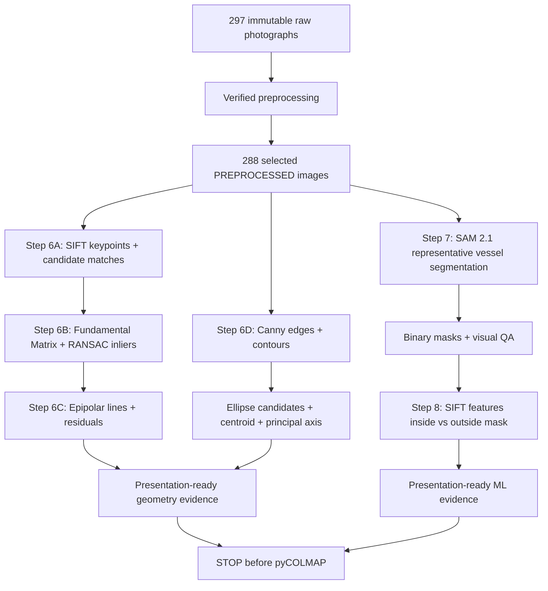

# Geometry Detection and ML Integration Design

Updated: 2026-08-28

## Status

**Step 6 is implemented and verified. Steps 7 and 8 remain provisional and must
be revised again before ML implementation begins.**

The verified preprocessing milestone remains unchanged: 297 immutable raw photographs, 207 `ACCEPT`, 81 `WARN`, 9 `REJECT`, and 288 PREPROCESSED images in `preprocessing/pycolmap_input/images/`.

Step 6 produced real classical-geometry code, reports, a popup visualizer, and
six presentation figures under the measured contract below. It did not produce
SAM 2 masks, ML model weights, pyCOLMAP feature extraction, or reconstruction.
The Step 7/8 descriptions below preserve the intended learning goals but are not
a frozen module layout or implementation contract.

## Current goal

Extend the completed preprocessing pipeline with two bounded implementation units that are easy to demonstrate during coursework assessment:

### Step 6 — Geometry Detection / Analysis

1. visible SIFT keypoints and candidate feature matches;
2. Fundamental Matrix estimation and RANSAC inlier filtering;
3. epipolar-line visualization and geometric residuals from the same two-view geometry;
4. 2D vessel-shape geometry using Canny edges, contours, ellipse fitting where valid, and a principal/symmetry axis.

### Steps 7 + 8 — Machine Learning + Feature-Mask Analysis

1. pretrained SAM 2.1 vessel segmentation on a representative subset of selected images;
2. binary vessel-mask QA and presentation overlays;
3. SIFT feature counts inside versus outside each vessel mask;
4. presentation figures showing what the ML segmentation identifies and how it changes the feature distribution considered vessel-related versus background-related.

The extension may analyze images and create derived masks/visualizations, but it must not crop, permanently resize, rotate, warp, perspective-correct, regenerate, or overwrite the 288 selected images.

## Why this design fits the project

The project already uses SIFT, Fundamental Matrix estimation, and RANSAC internally to compare RAW and PREPROCESSED image pairs. Step 6 exposes and explains this geometry rather than adding unrelated algorithms.

The single-image shape module adds intuitive classical computer vision: silhouette edges, contour candidates, ellipse-like vessel/rim structure, centroid, bounding box, and principal-axis direction. These measurements are descriptive only; they do not rectify or reshape the photographs.

The ML component is foreground segmentation rather than generative enhancement. SAM 2.1 labels which pixels belong to the vessel while leaving source images unchanged. Step 8 then uses those masks to measure where SIFT keypoints fall, creating a concrete ML/CV integration that can be shown before any reconstruction stage begins.

## Current planned pipeline



## Step 6 geometry design

### Stable input and coordinate contract

All analysis begins at `preprocessing/reports/selection_manifest.csv`, whose row
order defines the one-based selected-image index. A shared input module must:

- parse every selected row into an immutable record containing index, filename,
  variant, expected width/height, size, SHA-256, decision, and reasons;
- reject duplicate/unsafe filenames, missing or extra selected files, unreadable
  images, dimension/size/hash mismatches, and nondeterministic ordering;
- verify all 288 selected images before the real Step 6 orchestrator creates or
  replaces final output files;
- support a lighter single-record verification path for the interactive demo;
- keep every output outside both the immutable raw directory and the selected
  image directory.

Image sizes are always represented as `(width, height)`. OpenCV arrays remain
`(height, width, channels)`. SIFT keypoint coordinates and all estimated two-view
geometry are expressed in analysis-image pixels. The public SIFT result records
both original and analysis sizes plus explicit `scale_x_to_original` and
`scale_y_to_original` values. Downstream code must use that metadata rather than
guessing a resize factor. The source JPEG is never rewritten.

Step 6 configuration is explicit and serializable: maximum SIFT width `1200`,
up to `8000` SIFT features, BF-L2 `k=2`, Lowe ratio `0.75`, Fundamental-Matrix
RANSAC threshold `1.5` analysis pixels, confidence `0.99`, and OpenCV RNG seed
`4213`. Shape-analysis thresholds may be tuned from real images, but they must
live in a small documented configuration object and remain deterministic.

### Geometry 1 — keypoints, matching, and RANSAC inliers

Use selected PREPROCESSED neighboring pairs from the existing representative experiment.

Preferred presentation pair: **165-166**.

Preferred supporting/low-feature pair: **255-256**.

These indices are defaults, not forced outcomes. The real run may substitute a
nearby or otherwise representative selected pair when the measured geometry is
insufficient or the presentation is misleading. Any substitution must be based
on fresh candidate/inlier measurements, documented with the reason, and must not
silently turn a failed geometry estimate into a success.

Planned processing:

- SIFT up to 8,000 features;
- analysis width up to 1,200 pixels with aspect ratio preserved in memory;
- BF-L2 two-neighbor matching;
- Lowe ratio threshold `0.75`;
- Fundamental Matrix RANSAC threshold `1.5 px`;
- confidence `0.99`;
- fixed OpenCV RNG seed `4213`;
- candidate-match count, inlier count, and inlier ratio.

Planned presentation outputs:

```text
analysis/previews/presentation/geometry_01_matches_165_166.png
analysis/previews/presentation/geometry_01_matches_255_256.png
```

Each figure shows candidate SIFT matches and RANSAC-verified matches separately so incorrect correspondences are visibly filtered rather than hidden.

Descriptor-less inputs, fewer than eight candidates, malformed/non-finite/non-
3x3 Fundamental Matrices, and empty inlier masks return structured failure
statuses. Full candidate and inlier arrays are retained for measurement; a
deterministic spatial sample of at most 60 matches is used for drawing only.

### Geometry 2 — epipolar geometry

Reuse the exact Fundamental Matrix and RANSAC inlier set from Geometry 1.

Planned processing:

- select 8-10 spatially distributed verified correspondences;
- compute corresponding epipolar lines in the opposite view;
- draw matching point/line colors;
- compute Sampson/geometric residual summary.

Planned output:

`analysis/previews/presentation/geometry_02_epipolar_165_166.png`

Interpretation boundary: this is two-view projective geometry. It must not be described as a completed 3D reconstruction or camera-pose solution.

The epipolar stage accepts the exact successful two-view result; it never calls
Fundamental-Matrix estimation again. It selects approximately 8-10 spatially
distributed inliers for display, clips each line against real image borders,
and reports Sampson-error summaries over the complete verified inlier set.
Unavailable or invalid geometry produces an explicit failure result and no
misleading line figure.

### Geometry 3 — vessel shape geometry

Preferred single-image example: **165**.

Preferred secondary/top-down/detail example: **255**.

These are presentation defaults. A stronger real selected image may replace one
when the default lacks a defensible contour, ellipse, or axis. Weak results may
also be retained as a clearly labeled limitation when they teach something
useful; no contour or ellipse is forced merely to satisfy a filename.

Planned processing:

1. grayscale conversion;
2. Canny edge detection;
3. contour extraction;
4. simple explainable vessel-contour candidate scoring;
5. bounding box and centroid;
6. ellipse fitting where enough contour points exist;
7. PCA/second-moment principal-axis estimation;
8. report failure honestly when no reliable contour/ellipse exists.

Planned outputs:

```text
analysis/previews/presentation/geometry_03_shape_165.png
analysis/previews/presentation/geometry_03_shape_255.png
analysis/previews/presentation/geometry_04_summary.png
```

The Step 6 summary combines only the three geometry demonstrations. It does not depend on ML.

Classical shape analysis uses an aspect-preserving in-memory analysis copy,
explicit grayscale/Canny thresholds, optional small morphological cleanup, and
explainable contour scoring based on measured area, centrality, border contact,
and extent. It returns candidate diagnostics plus structured statuses such as
`ok`, `weak_contour`, `no_reliable_contour`, and `ellipse_unavailable`. Bounding
box, centroid, second-moment/PCA axis, and optional ellipse coordinates are
reported in analysis pixels with the original/analysis scale relationship.

### Step 6 execution and evidence contract

The real orchestrator performs full selected-set verification before creating
final Step 6 outputs, resolves configured representative records, computes fresh
geometry against the selected JPEGs, writes machine-readable metrics/config and
source provenance, renders the professor-facing PNGs, and writes a summary JSON.
The interactive launcher reuses these analysis/rendering functions, prints the
same measured metrics, opens labeled OpenCV windows by default, supports a
bounded `--no-display` smoke path, and closes cleanly on a documented keypress.

Final visual acceptance requires unstretched images, readable labels, restrained
match density, correctly clipped epilines, correspondence-consistent colors,
honest weak/failure labels, and contour/ellipse/axis overlays that agree with the
visible image. File existence alone is not visual verification.

## Steps 7 + 8 ML design (provisional)

The goals below remain useful, but all module names, class names, prompt-file
locations, environment choices, and task decomposition are revisable. Future ML
work must begin with a new design check after Step 6 is complete. Step 6 must not
import ML code or depend on SAM-specific abstractions.

The only stable downstream dependency promised by Step 6 is:

- deterministic verified selected-image records and one-based lookup;
- a verified per-record loading path;
- reusable SIFT extraction with keypoints/descriptors;
- original and analysis image sizes;
- explicit analysis-to-original coordinate scale metadata.

### Model choice

Use **Meta SAM 2.1** with `sam2.1_hiera_small` for the first feasibility pass.

Do not train or fine-tune a custom segmentation model initially. Do not move to a larger checkpoint unless the small checkpoint fails meaningfully on the representative project images.

### Environment boundary

Keep SAM 2/PyTorch runtime dependencies isolated from the already-verified preprocessing environment until compatibility is confirmed. Model checkpoints and runtime caches must stay outside tracked repository content.

### Representative image set

The current ML phase uses exactly ten selected-image indices that already span the preprocessing representative sequence:

```text
15, 45, 75, 105, 135, 165, 195, 225, 255, 280
```

This is intentionally limited to ten images because the current goal is a useful, measurable ML demonstration—not full reconstruction masking.

### Prompt strategy

Use one reproducible normalized XYXY box prompt per representative image. Record the prompts in:

`analysis/config/ml_prompts.json`

The future implementation must visually choose boxes around the complete vessel and validate them against the selection manifest. If a mask is weak, adjust that image's prompt and record the correction rather than silently accepting a bad mask.

### Segmentation outputs

Generate same-size binary masks containing only `0` and `255` for the ten representative images.

Planned evidence:

1. `analysis/previews/presentation/ml_01_segmentation_165.png`
   - original selected image;
   - binary vessel mask;
   - mask overlay.

2. `analysis/previews/presentation/ml_02_mask_contact_sheet.png`
   - all ten representative images with mask overlays and status labels.

Mask QA records at minimum:

- source index/filename;
- model/checkpoint;
- prompt box;
- foreground area fraction;
- mask bounding box;
- corrected/not corrected;
- success/failure status.

A failed segmentation does not reject or modify the source photograph.

### Step 8 feature-mask analysis

Reuse Step 6's public SIFT extraction interface so the ML plan does not implement a second SIFT pipeline.

For each successful representative mask:

1. detect SIFT features at the same Step 6 analysis scale;
2. align the binary mask to that analysis scale using nearest-neighbor interpolation;
3. count keypoints inside the vessel mask;
4. count keypoints in background regions;
5. calculate vessel-feature fraction and background-feature fraction;
6. keep all counts descriptive—do not claim reconstruction improvement.

Planned outputs:

```text
analysis/previews/presentation/ml_03_masked_features_165.png
analysis/previews/presentation/ml_04_feature_mask_summary.png
analysis/previews/presentation/ml_05_summary.png
```

The final ML summary should show:

```text
SAM 2.1 input + prompt
→ vessel mask
→ mask overlay
→ SIFT features inside/outside mask
→ ten-image measured summary
```

## Illustrative repository structure

```text
analysis_common.py                       verified selected-image input boundary
geometry_detection.py                   SIFT/F-matrix/RANSAC/epipolar analysis
shape_geometry.py                       Canny/contour/ellipse/principal-axis analysis
run_geometry_analysis.py                Step 6 orchestration

future ML modules                       names and split to be redesigned later

tests/
  test_analysis_common.py
  test_geometry_detection.py
  test_shape_geometry.py
  test_run_geometry_analysis.py
  test_ml_prompt_config.py
  test_ml_segmentation.py
  test_ml_feature_analysis.py
  test_run_ml_analysis.py

analysis/
  config/
    ml_prompts.json
  geometry/
  ml/
    masks/
  reports/
  previews/
    presentation/
```

The Step 6 filenames are the preferred small architecture for the current task.
The ML filenames are intentionally not fixed and must not drive Step 6 design.

## Verification requirements

### Step 6

- selected inputs verify against the existing 288-row manifest before outputs are created;
- SIFT/RANSAC settings match the documented values;
- Fundamental Matrix is finite 3x3 when geometry is valid;
- displayed RANSAC matches are true inliers from the same run;
- epipolar lines use the same `F` and correspondences;
- shape overlays never modify source images;
- all Step 6 presentation figures receive visual inspection;
- all 297 raw and 288 selected images remain hash-identical after the run.
- focused tests and changed-file compilation pass in fresh final runs;
- the popup visualizer's noninteractive rendering path completes without writing
  into source directories;
- task-created cache/scratch/failed-output residue is removed after inspection.

### Steps 7 + 8

- Step 6 prerequisite interfaces are present and tested;
- only the ten representative images are segmented in the current phase;
- masks are binary and source-size;
- model/checkpoint/runtime provenance is recorded;
- masks receive visual QA and correction/failure status;
- feature-mask counts reuse Step 6 SIFT extraction;
- all ML presentation figures are generated from real outputs;
- all 297 raw and 288 selected images remain hash-identical after the run.

## Current implementation-plan split

- Step 6: `docs/superpowers/plans/2026-08-27-step-6-geometry-detection-analysis.md`
- Steps 7+8: `docs/superpowers/plans/2026-08-27-steps-7-8-ml-segmentation-feature-mask-analysis.md`
- Index: `docs/superpowers/plans/2026-08-27-geometry-ml-integration.md`

## Explicit stop boundary

The current work ends after Steps 6-8 are implemented, measured, visually inspected, documented, and verified.

**Do not create or execute a pyCOLMAP/reconstruction implementation plan as part of these two plans.** A later reconstruction plan can be designed separately when explicitly requested.

## Out of scope

- full 288-image ML mask generation;
- pyCOLMAP or COLMAP execution;
- sparse or dense reconstruction;
- custom SAM 2 training/fine-tuning;
- generative reflection removal, inpainting, texture synthesis, or object redrawing;
- learned depth used as fabricated reconstruction geometry;
- geometric warping or perspective correction;
- meshing, texturing, or Blender cleanup.

## External reference for future ML implementation

- Meta SAM 2 official repository and SAM 2.1 checkpoints: <https://github.com/facebookresearch/sam2>
