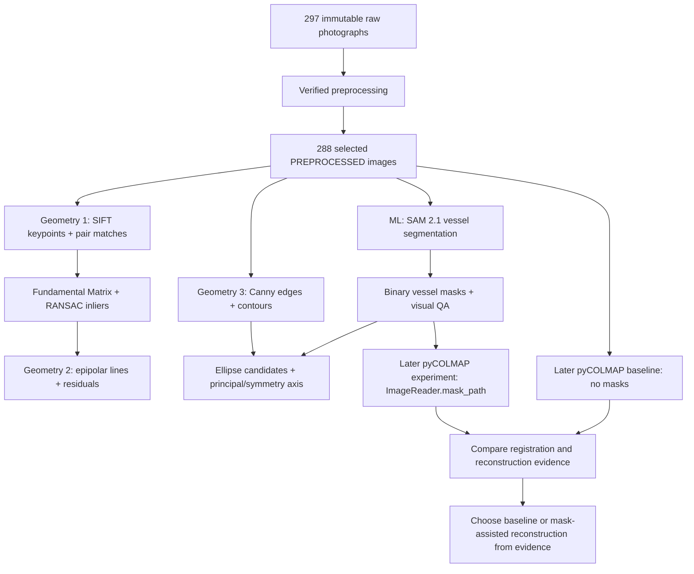

# Geometry Detection and ML Integration Design

Updated: 2026-08-27

## Status

**Planning only. Nothing in this document is implemented yet.**

The verified preprocessing milestone remains unchanged: 297 immutable raw photographs, 207 `ACCEPT`, 81 `WARN`, 9 `REJECT`, and 288 PREPROCESSED images in `preprocessing/pycolmap_input/images/`. No geometry-extension code, SAM 2 masks, ML model weights, pyCOLMAP feature extraction, or reconstruction has been run as part of this planning change.

## Goal

Extend the current computer-vision pipeline with three explicit geometry demonstrations and one useful machine-learning component that can be shown clearly during coursework assessment:

1. visible SIFT keypoints, feature matches, Fundamental Matrix estimation, and RANSAC inlier filtering;
2. epipolar-geometry visualization from the same verified two-view geometry;
3. 2D vessel-shape geometry using edges, contours, ellipse fitting, and a symmetry/principal axis;
4. pretrained SAM 2.1 vessel segmentation, producing masks that can later be compared as a pyCOLMAP feature-extraction aid.

The extension must preserve the existing photogrammetric input geometry. It may analyze images and create derived masks/visualizations, but it must not crop, resize, warp, perspective-correct, regenerate, or overwrite the 288 selected images.

## Why this design fits the project

The project already uses SIFT, Fundamental Matrix estimation, and RANSAC internally to compare RAW and PREPROCESSED image pairs. The first two geometry modules therefore expose and explain geometry that already exists in the workflow rather than adding unrelated algorithms.

The third module adds classical 2D shape analysis that is easy to demonstrate on the brass vessel: silhouette edges, vessel contour, rim/bowl ellipse candidates, and an estimated principal/symmetry axis. These measurements are descriptive evidence only; they are not used to rectify or reshape the photographs.

The ML component is foreground segmentation rather than generative enhancement. A pretrained segmentation model marks vessel pixels while leaving the source image unchanged. This is directly useful because current COLMAP/pyCOLMAP supports per-image feature masks through `ImageReader.mask_path`; features are not extracted in black mask regions. The later reconstruction stage can therefore compare the same 288 images with and without ML-generated masks.

## Planned pipeline



## Geometry module 1 — keypoints, matching, and RANSAC inliers

### Purpose

Make the existing two-view matching process visible and explainable.

### Input

Use selected PREPROCESSED neighboring pairs from the existing SIFT experiment. The primary presentation pair should be indices **165-166**, because it is a normal vessel view with many useful correspondences. A second low-feature example should use **255-256** so the demonstration does not imply that every pair is equally easy.

### Planned processing

- detect SIFT keypoints/descriptors;
- run BF-L2 two-neighbor matching;
- apply the existing Lowe ratio threshold of `0.75`;
- estimate a Fundamental Matrix with RANSAC using the same `1.5 px` threshold and `0.99` confidence used by the verified preprocessing experiment;
- separate candidate matches from geometrically verified inliers;
- calculate keypoint count, good-match count, inlier count, and inlier ratio.

### Planned visual output

`analysis/previews/presentation/geometry_01_matches_165_166.png`

The figure should contain two clearly labeled rows:

1. **Candidate SIFT matches** — side-by-side images with a bounded sample of ratio-test matches;
2. **RANSAC-verified matches** — the same image pair with only geometric inliers highlighted.

A small text panel should show the pair filenames, keypoint counts, candidate-match count, verified-inlier count, and inlier ratio. The figure must avoid hundreds of overlapping lines; use a deterministic spatially distributed subset for display while retaining full counts in the report.

A second supporting figure may use `255-256` to show how geometry verification behaves when the image pair has fewer features.

## Geometry module 2 — epipolar geometry

### Purpose

Show the geometric constraint created by the Fundamental Matrix rather than presenting RANSAC as a black box.

### Planned processing

- reuse the Fundamental Matrix and RANSAC inliers from Geometry 1;
- choose 8-12 spatially distributed inlier correspondences;
- compute the epipolar line in the opposite image for each selected point;
- draw each point and its corresponding line using the same color in both views;
- compute an epipolar/Sampson residual summary for the verified inliers.

### Planned visual output

`analysis/previews/presentation/geometry_02_epipolar_165_166.png`

The figure should show the two photographs next to each other, with 8-12 colored point/line correspondences. Include the estimated Fundamental Matrix and median geometric residual in a compact caption or side panel. The purpose is to show that a point in one image constrains where its match should lie in the other image.

### Interpretation boundary

This is two-view projective geometry. It does not prove a complete 3D reconstruction and must not be described as camera-pose recovery by itself.

## Geometry module 3 — vessel shape geometry

### Purpose

Provide an intuitive, classical computer-vision demonstration of geometric structure visible in a single vessel image.

### Planned processing

For representative images such as index 165 and a top-down/detail image such as index 255:

1. convert to grayscale;
2. run Canny edge detection;
3. find contours;
4. identify vessel/silhouette contour candidates;
5. fit ellipse candidates where contours contain enough points;
6. estimate a principal/symmetry axis from the selected contour using contour moments/PCA;
7. report contour area, bounding box, ellipse axes/angle where available, and axis angle.

When a valid SAM 2 vessel mask exists, the shape module may use it to isolate the vessel before contour extraction. The report must label this as **mask-assisted shape analysis** rather than pretending the mask came from classical edge detection.

### Planned visual output

`analysis/previews/presentation/geometry_03_shape_165.png`

Use a four-panel layout:

1. original selected image;
2. Canny edge map;
3. selected vessel contour/silhouette overlay;
4. ellipse candidate(s), centroid, bounding box, and principal/symmetry axis overlay.

This output is explanatory geometry only. It must not be fed back into preprocessing as a warp, crop, or perspective correction.

## Machine-learning module — SAM 2.1 vessel segmentation

### Model choice

Use **Meta SAM 2.1** as the planned pretrained segmentation model. Start with `sam2.1_hiera_small` because it is a smaller checkpoint and is sufficient for the first feasibility pass. Do not move to base+/large unless representative-mask evidence shows that the small checkpoint is inadequate.

Do not train or fine-tune a custom model initially. The project needs a clear ML integration, not an unnecessary training project.

### Environment boundary

Do not add PyTorch/SAM 2 dependencies to the already-verified preprocessing environment until compatibility is checked. The official SAM 2 documentation recommends WSL on Windows. The implementation phase should therefore perform a separate ML-environment preflight and keep model runtime dependencies isolated from `requirements.txt` unless there is a demonstrated reason to merge them.

Model checkpoints must not be committed to Git. Record model name/checkpoint provenance and download instructions instead.

### Segmentation strategy

Treat the ordered 288-image capture sequence as a near-neighbor image sequence for promptable segmentation/tracking:

1. initialize SAM 2.1 on the selected image sequence;
2. provide a point or box prompt around the vessel on an anchor frame;
3. propagate the vessel mask through neighboring frames;
4. add correction prompts when visual QA shows drift or missing vessel regions;
5. retain the complete vessel, including rim, neck, bowl, pedestal, and silhouette boundary;
6. generate a conservative binary mask for every selected image.

If a generated mask fails QA for one image, do **not** reject that photograph. The safe fallback is a full-white mask for that image, which preserves baseline feature extraction while recording the segmentation failure.

### Mask format for pyCOLMAP

Planned directory:

`analysis/ml/masks/`

For an image named:

`IMG20260826125013.jpg`

the corresponding COLMAP mask must be:

`IMG20260826125013.jpg.png`

Mask convention:

- white (`255`) = vessel/allowed feature region;
- black (`0`) = background/suppressed feature region.

The masks are derived annotations. They must never replace or modify the JPEG inputs.

### Planned ML visual outputs

1. `analysis/previews/presentation/ml_01_segmentation_165.png`
   - original image;
   - binary mask;
   - colored mask overlay on the original.

2. `analysis/previews/presentation/ml_02_mask_contact_sheet.png`
   - representative masks across middle, low, elevated, top-down, detail, and WARN views;
   - include any correction/fallback cases explicitly.

3. `analysis/previews/presentation/ml_03_masked_features_165.png`
   - unmasked SIFT keypoints;
   - mask overlay;
   - keypoints remaining when the mask is applied;
   - counts inside/outside the vessel mask.

These figures make the ML contribution visible without claiming reconstruction improvement before it is measured.

## Later pyCOLMAP comparison

This comparison belongs to the separately authorized reconstruction phase, not this planning task.

Run two controlled sparse-reconstruction experiments with identical image sets and comparable camera/matching settings:

### Baseline A — unmasked

- 288 selected PREPROCESSED images;
- normal pyCOLMAP feature extraction;
- no ML mask path.

### Experiment B — SAM 2 mask-assisted

- same 288 selected PREPROCESSED images;
- same camera model and matching strategy;
- `ImageReader.mask_path` points to `analysis/ml/masks/`.

### Compare

Record at minimum:

- extracted keypoints/features;
- verified matches;
- registered images;
- sparse 3D point count;
- mean/median track length where available;
- mean/median reprojection error where available;
- visual amount of background clutter in the sparse model;
- failed/weak registration regions in the image sequence.

Use the mask-assisted run only if it improves object focus without materially damaging camera registration. A practical guardrail is to reject the masked variant if registered-image count falls by more than 5% relative to the baseline unless there is a clearly documented compensating benefit. Do not assume ML is better simply because it is ML.

## Presentation sequence

The later course demonstration should be easy to follow in this order:

1. **Input** — show one of the 288 selected PREPROCESSED vessel images.
2. **Geometry 1** — show SIFT candidate matches and RANSAC-verified matches.
3. **Geometry 2** — show epipolar lines for the same image pair.
4. **Geometry 3** — show Canny edges, contour, ellipse, and principal/symmetry axis on one vessel image.
5. **Machine learning** — show original, SAM 2.1 mask, and overlay.
6. **Why ML matters** — show unmasked versus mask-filtered feature locations.
7. **Later reconstruction evidence** — compare baseline and mask-assisted pyCOLMAP sparse models and metrics after that phase is actually run.

A final summary figure should be generated later at:

`analysis/previews/presentation/geometry_ml_pipeline_summary.png`

It should combine small thumbnails from the three geometry modules and the ML mask into one labeled workflow. It must use actual generated outputs, not illustrative/fabricated reconstruction results.

## Planned repository structure

```text
geometry_detection.py                   two-view matching/F-matrix/epipolar analysis
shape_geometry.py                       Canny/contour/ellipse/axis analysis
ml_segmentation.py                      SAM 2.1 inference, mask QA, mask export
run_geometry_ml_analysis.py             deterministic analysis/report orchestration

tests/
  test_geometry_detection.py
  test_shape_geometry.py
  test_ml_segmentation.py
  test_run_geometry_ml_analysis.py

analysis/
  geometry/
  ml/
    masks/
  reports/
  previews/
    presentation/
```

This structure is planned only; none of these paths should be created as generated output until the relevant implementation task is authorized.

## Verification requirements for the future implementation

### Geometry

- identical image dimensions before/after any visualization input handling;
- deterministic SIFT/RANSAC results under a fixed OpenCV RNG seed where applicable;
- Fundamental Matrix is finite and rank-2 within numerical tolerance for valid pairs;
- displayed RANSAC lines correspond only to verified inliers;
- epipolar points/lines are derived from the same `F` and selected matches;
- shape overlays never modify source images.

### ML segmentation

- masks are binary, readable PNGs and match image dimensions exactly;
- mask filenames follow COLMAP's required `<image filename>.png` convention;
- no original/preprocessed JPEG is modified;
- representative masks are visually inspected across the full capture range;
- low-quality masks trigger correction or full-white fallback, not image deletion;
- model/checkpoint provenance is recorded;
- model weights and caches are not committed.

### Integration

- geometry/ML reports state which steps are completed versus planned;
- pyCOLMAP baseline and masked runs use the same 288-image set;
- any claim that ML improves reconstruction must be supported by measured comparison results;
- all final presentation figures are generated from real project outputs.

## Out of scope for the first implementation

- custom SAM 2 training or fine-tuning;
- generative reflection removal, texture synthesis, inpainting, or object redrawing;
- learned depth estimation used as fake reconstruction geometry;
- geometric warping or perspective correction of the 288 inputs;
- adding multiple ML models merely to increase the number of techniques;
- dense reconstruction, meshing, texturing, or Blender until the sparse stage is evaluated.

## External references used for this design

- COLMAP/pyCOLMAP `ImageReaderOptions.mask_path`: <https://colmap.github.io/pycolmap/pycolmap.html>
- COLMAP FAQ, mask image regions: <https://colmap.github.io/faq.html>
- Meta SAM 2 official repository and SAM 2.1 checkpoints: <https://github.com/facebookresearch/sam2>
